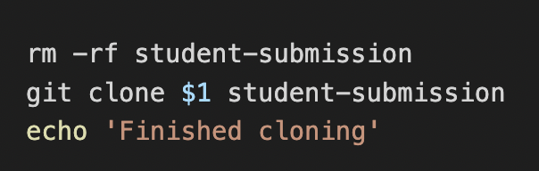
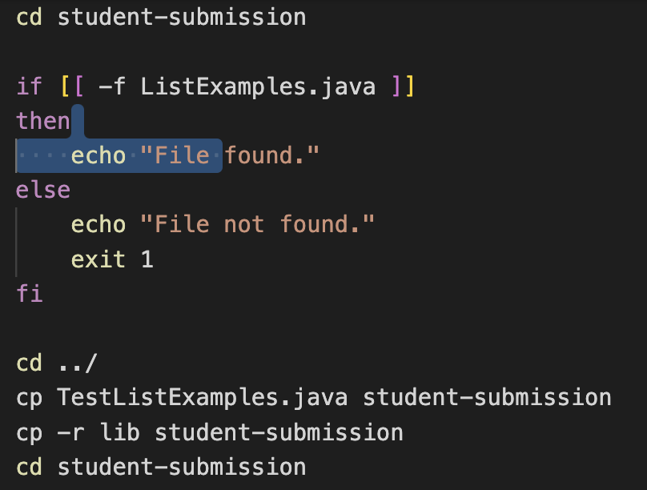
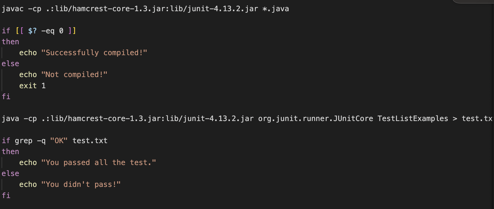

# Lab Report 5
I completed the grading script with my lab partner during lab time and was able to successfully execute it on all the different files provided on the lab docs.

## Explanation of the Code

The three lines of code does:
1. Deletes any previously existing folders of `student-submission`
2. Clones the original `student-submission` folder from Github
3. Prints out `Finished cloning` once the process is done

Here these lines of code does:
1. Changes directory to the `student-submission` folder
2. Checks if the current directory contains the file `ListExamples.java`. If it does containt it, the terminal prints `File found`. If it doesn't, it prints `File not found` and exits the process.  
3. Once the file is found, we return to the parent directory. 
4. From here, we copy the file `TestListExamples.java` 
5. And the folder `lib` into `student-submission` 
6. And go back into `student-submission`

The final steps finishs with:
1. Compile the files in the `student-submission` folder
2. Checks for successful compliation, and if true prints `Successfully compiled!`, if not it prints `Not compiled` and exits the process.
3. Once compiled, we run the JUnit tests and store the results in `test.txt`
4. We check if the `test.txt` file contains `OK` as that indicates no error in the testing. If `OK` is found, it prints `You passed all the test.`, if not it prints `You didn't pass!`.
